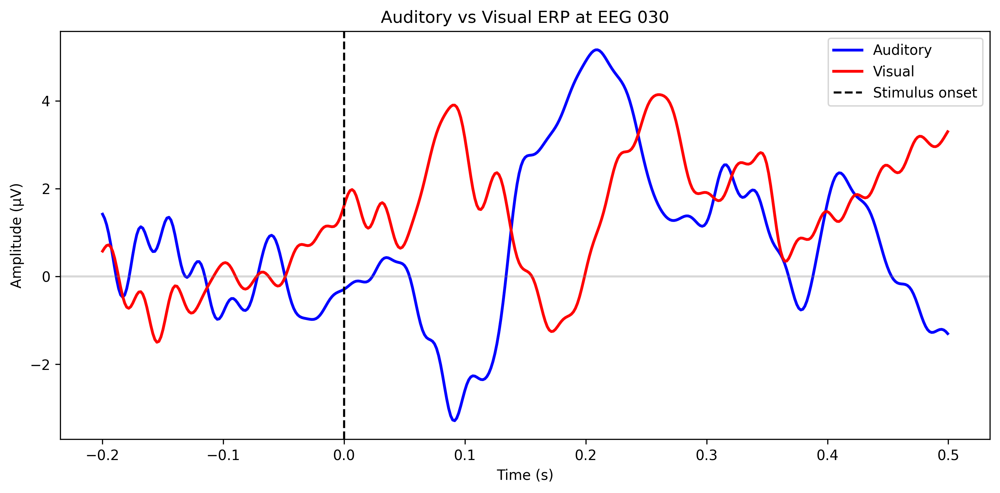
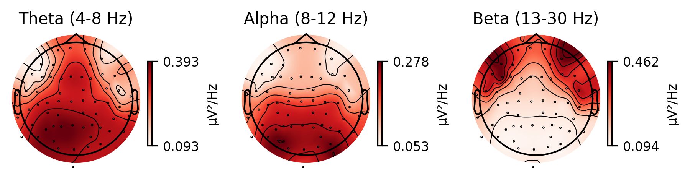
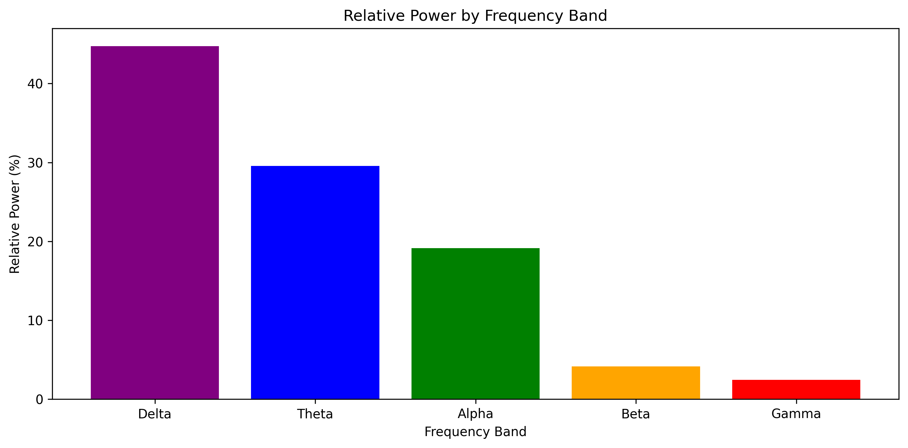

## EEG Signal Processing Pipeline

A complete end-to-end pipeline for preprocessing and analyzing EEG data, demonstrating core skills in neural signal processing, artifact rejection, and brain data analysis.

### Project Overview

This project implements a full EEG analysis workflow from raw data to meaningful results:

- **Filtering**: Bandpass and notch filters to isolate relevant brain signals
- **Artifact Rejection**: ICA-based removal of eye blinks and other artifacts
- **Event-Related Potentials (ERPs)**: Time-locked brain responses to stimuli
- **Spectral Analysis**: Power distribution across frequency bands (Delta, Theta, Alpha, Beta, Gamma)

### Example Results

#### Auditory vs Visual ERPs
The brain responds differently to sounds vs images. Auditory stimuli produce a sharp N100 component (~100ms), while visual stimuli show a slower, later response.



#### Scalp Topography by Frequency Band
Different frequency bands show distinct spatial patterns. Alpha power (8-12 Hz) is strongest over the occipital (visual) cortex — a classic neuroscience finding.



#### Power by Frequency Band
Spectral analysis reveals the distribution of brain oscillations:



### Project Structure

```
eeg-pipeline/
├── data/                    # Raw data (or download scripts)
├── notebooks/
│   ├── 01_data_exploration.ipynb    # Load and visualize raw EEG
│   ├── 02_filtering.ipynb           # Bandpass and notch filtering
│   ├── 03_artifact_rejection.ipynb  # ICA-based artifact removal
│   ├── 04_erp_analysis.ipynb        # Event-related potentials
│   └── 05_spectral_analysis.ipynb   # Frequency band analysis
├── src/
│   └── pipeline.py          # Reusable preprocessing functions
├── figures/                 # Publication-quality figures
├── README.md
└── requirements.txt
```

### Installation

```bash
# Clone the repository
git clone https://github.com/yourusername/eeg-pipeline.git
cd eeg-pipeline

# Create virtual environment
python3 -m venv venv
source venv/bin/activate  # On Windows: venv\Scripts\activate

# Install dependencies
pip install -r requirements.txt
```

### Usage

#### Quick Start with the Pipeline Module

```python
from src.pipeline import full_preprocessing_pipeline, compute_band_power

# Run full preprocessing
raw, ica = full_preprocessing_pipeline('path/to/your/data.fif')

# Analyze frequency content
band_power, relative_power = compute_band_power(raw)
print(relative_power)
# {'Delta': 44.7%, 'Theta': 29.5%, 'Alpha': 19.1%, 'Beta': 4.1%, 'Gamma': 2.4%}
```

#### Step-by-Step Notebooks

For a detailed walkthrough, see the notebooks in order:

1. **01_data_exploration.ipynb** — Load data, understand structure, visualize raw traces
2. **02_filtering.ipynb** — Apply bandpass filter, compare before/after
3. **03_artifact_rejection.ipynb** — Use ICA to remove eye blinks
4. **04_erp_analysis.ipynb** — Extract event-related potentials
5. **05_spectral_analysis.ipynb** — Analyze power across frequency bands

### Key Findings

1. **Successful artifact removal**: ICA identified and removed eye blink components while preserving brain signals
2. **Clear ERP components**: N100 and P200 components visible in auditory responses
3. **Distinct auditory vs visual processing**: Different temporal dynamics for each modality
4. **Alpha rhythm localization**: 8-12 Hz power strongest over occipital cortex

### Dataset

This project uses the [MNE Sample Dataset](https://mne.tools/stable/overview/datasets_index.html), which contains:
- 60 EEG channels + 306 MEG channels
- Auditory and visual oddball paradigm
- ~5 minutes of recording
- Event markers for left/right auditory and visual stimuli

### References

- [MNE-Python Documentation](https://mne.tools/stable/index.html)
- Gramfort et al. (2013). MEG and EEG data analysis with MNE-Python. Frontiers in Neuroscience.
- Luck, S.J. (2014). An Introduction to the Event-Related Potential Technique. MIT Press.

### Author

Aleksandra Szymanska
